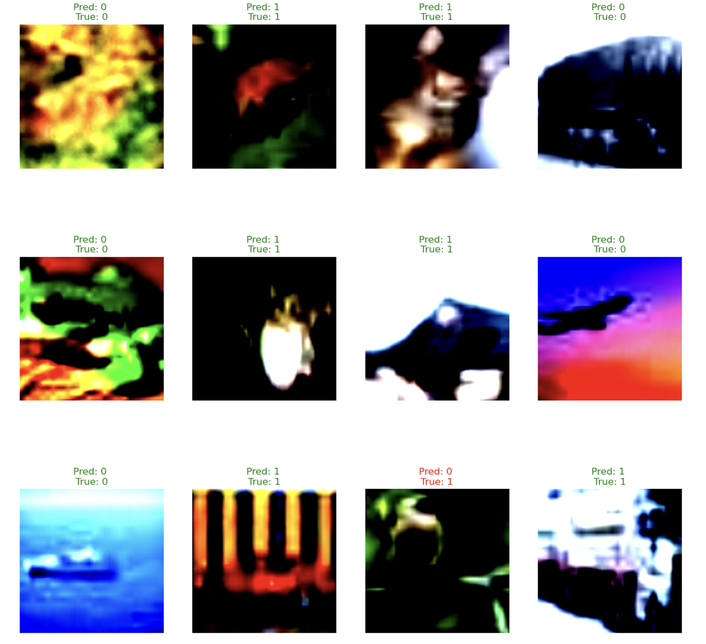

# **FEAL: Fake or Real? Binary Classification Using a Custom Augmented Dataset**

## **Objective**
This project seeks to distinguish between real and AI-generated (fake) images using binary classification techniques. By leveraging deep learning models, we aim to improve the accuracy of image classification, especially in detecting AI-generated content.

## **Dataset**
We utilize the **CIFAKE Dataset**, which is a curated collection of real and AI-generated images. This dataset serves as the base for training our models. You can find the CIFAKE dataset [here](https://www.kaggle.com/datasets/birdy654/cifake-real-and-ai-generated-synthetic-images/data).
The augmented dataset can be found [here](https://drive.google.com/drive/folders/19GDoDJ2RMibmf1e7ELy6ijQn5aTGebFY?usp=sharing)

## **Methods**
The approach integrates the following steps:
1. **Deep Convolutional Generative Adversarial Network (DCGAN)**:
   - A DCGAN is used to generate synthetic images, mimicking real images from the CIFAKE dataset.
   
2. **Data Augmentation**:
   - We augment the CIFAKE fake images dataset by adding synthetic images generated by the DCGAN. This augmentation increases the diversity of the dataset by 20-30%, improving model robustness.

3. **Fine-tuning ResNet-18**:
   - A pre-trained **ResNet-18** model is fine-tuned on the augmented dataset, enabling it to better differentiate between real and AI-generated images.

4. **Binary Classification**:
   - Using the fine-tuned ResNet-18 model, the images are classified as either real or fake.

## **Implementation**

### **DCGAN Training**
We implemented a **Deep Convolutional GAN** to generate synthetic images that resemble real images from the CIFAKE dataset. The training process includes:
- **Generator Network**: Produces fake images from random noise.
- **Discriminator Network**: Differentiates between real and fake images.
- Both networks are trained adversarially for **70 epochs**, with the generator gradually learning to create more realistic images, and the discriminator becoming more adept at distinguishing fake from real images.

### **Model Performance**
The fine-tuned **ResNet-18** model, after training on the augmented dataset, achieved an impressive accuracy of **97.33%**. This indicates a high level of success in distinguishing between real and AI-generated images, both from the original and augmented datasets.

### **Training Progression**
The DCGAN generated synthetic images that progressively improved over the training epochs. A GIF showing the improvement in image quality can be found in the repository, visualizing the learning process of the generator.


### **Generated Images**
Here is an example of training progression of DCGAN:


Here is an example of the ResNet-18 model's performance:


## **Trained Models**
The trained models can be installed from [here](https://drive.google.com/drive/folders/19GDoDJ2RMibmf1e7ELy6ijQn5aTGebFY?usp=sharing)

## **Dependencies**
To run the project, install the necessary dependencies with the following command:

```bash
pip install -r requirements.txt
```

## Future Work

- Fine-tune the pre-trained ResNet-18 model using the augmented dataset.
- Evaluate the performance of the classifier on both the original and augmented datasets.

## Citations

1. Krizhevsky, A., & Hinton, G. (2009). Learning multiple layers of features from tiny images.
2. Bird, J.J. and Lotfi, A., 2024. CIFAKE: Image Classification and Explainable Identification of AI-Generated Synthetic Images. IEEE Access.
3. Radford, A., et al. (2015). Unsupervised representation learning with deep convolutional generative adversarial networks. arXiv preprint arXiv:1511.06434.
4. He, K., et al. (2016). Deep residual learning for image recognition. Proceedings of the IEEE conference on computer vision and pattern recognition.
